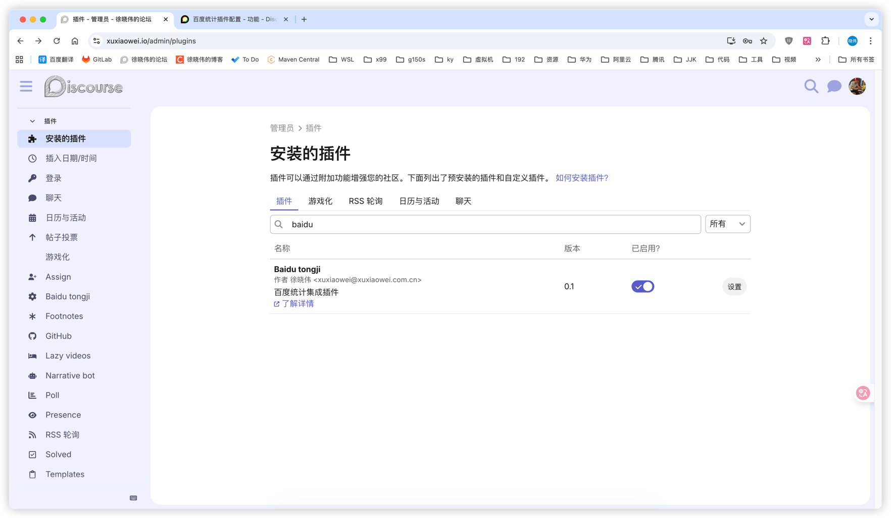
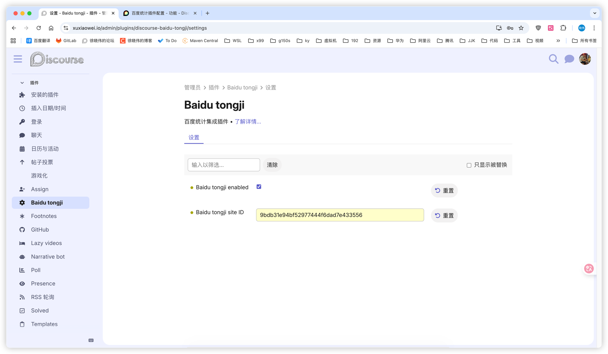
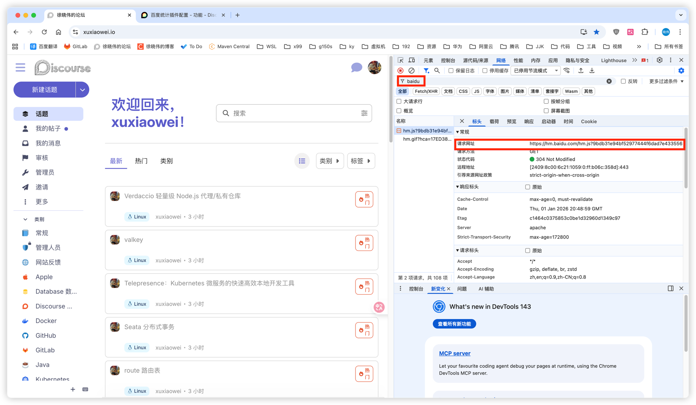

# 百度统计 Discourse 插件

这是一个 Discourse 插件，用于集成百度统计到您的 Discourse 论坛中。

## 功能

- 集成百度统计跟踪代码
- 支持通过管理界面配置百度统计站点 ID
- 可开关控制

## 安装

- 将代码克隆到插件目录 `/var/www/discourse/plugins`
    ```shell
    docker exec -it discourse-web-1 bash
    cd /var/www/discourse/plugins
    git clone https://github.com/xuxiaowei-com-cn/discourse-baidu-tongji.git
    ```
- 重启容器
    ```shell
    docker restart discourse-web-1
    ```





## 说明

- 如果浏览器安装了 [AdGuard](https://adguard.com) 等软件，可能会出现异常。
    1. 使用无痕浏览器测试
    2. 将域名添加到白名单
    3. 暂时关闭 AdGuard 重试
